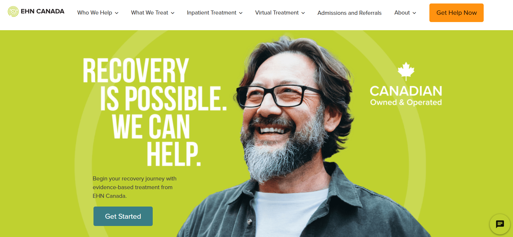

  

## Meet the Team

|  |  |  |
|:--:|:--:|:--:|
| **Hans Bisoo**  | **Lynn Liu**  | **Timmy Williams**  |

## Project Brief

As part of the final EHN Canada AI team, we were engaged by [EHN Canada](https://www.edgewoodhealthnetwork.com), a national leader in addictions and  mental health treatment - including depression, anxiety, trauma and PTSD. 

EHN’s mission-driven care spans several specialized programs, and they interact with over **10,000 inquiries per month** through its Admissions Team alone.

Our challenge was to identify and optimize a  bottleneck in the *discovery dialogue* process used by the Admissions Team. These high-volume, often time-sensitive conversations require accurate and empathetic responses, crafted from both **clinical knowledge** and the **specific offerings and nuances** of EHN's programs. Given the scale and complexity, the team needed a more efficient way to retrieve internal knowledge during live interactions.

We designed and developed an **LLM Platform** to augment internal admissions workflows. At its core is a **real-time chatbot**, trained on EHN’s internal knowledge bases and optimized for internal use. The system includes a simple interface for updating the knowledge base, allowing non-technical staff to keep content current without relying on developers.

To ensure reliability and alignment with internal needs, we integrated `DeepEval` as part of our continuous evaluation pipeline. This helped us quantify metrics (hallucination, bias, accuracy), test retrieval performance, and select default models that were both efficient and accurate. Our platform leverages **open-source tools and locally-hosted models**, reflecting our commitment to privacy, transparency, and long-term maintainability.

The result is a scalable, secure, and customizable AI support layer for EHN’s Admissions Team—reducing information retrieval friction, increasing consistency across staff responses, and freeing up the admissions staff to focus on high-empathy, high-impact conversations.

